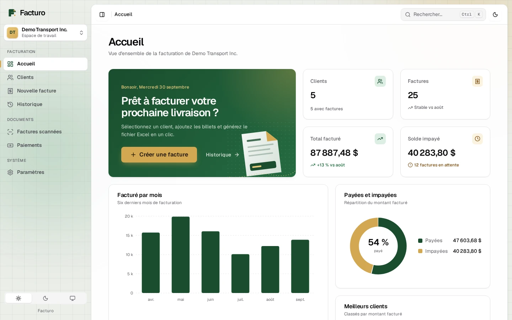
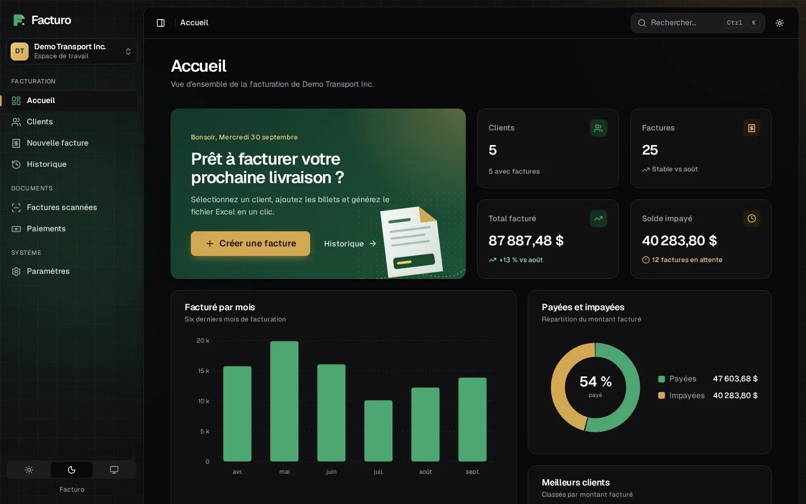
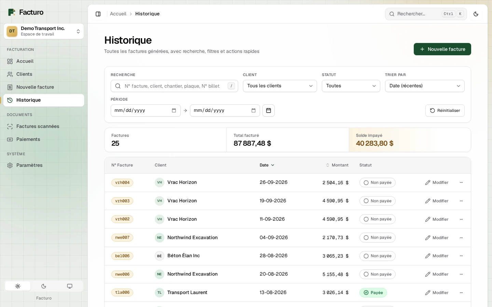
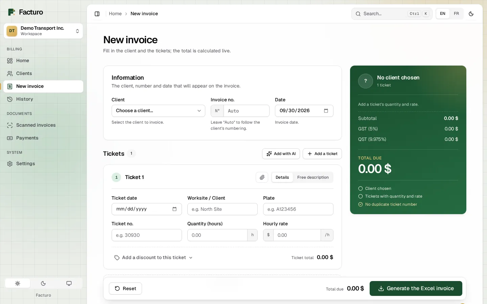
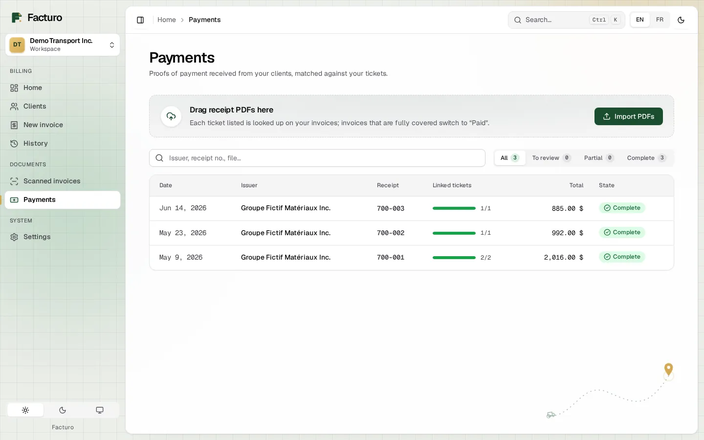
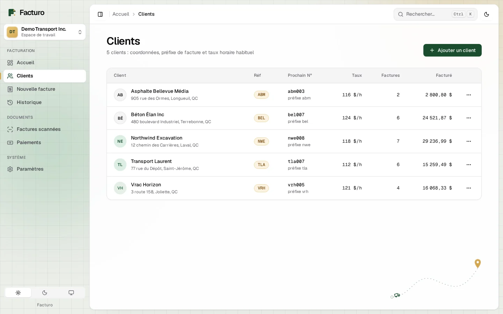
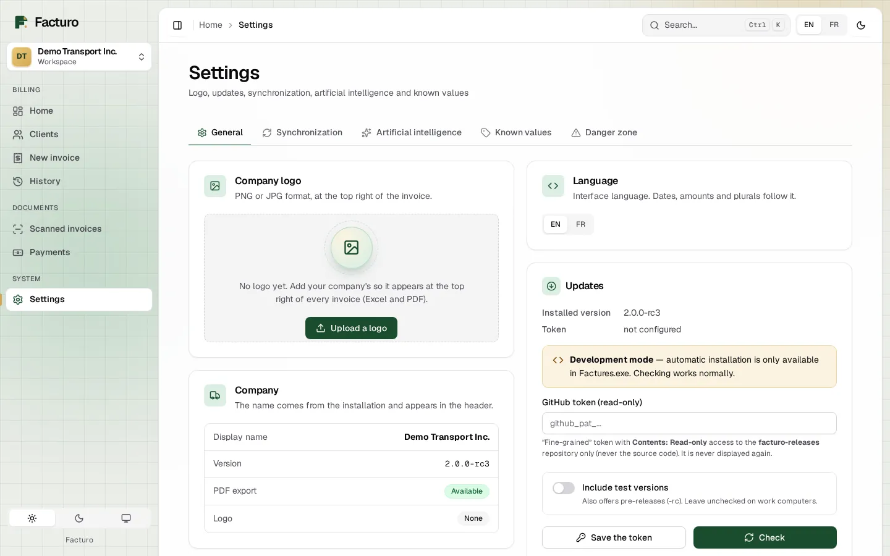
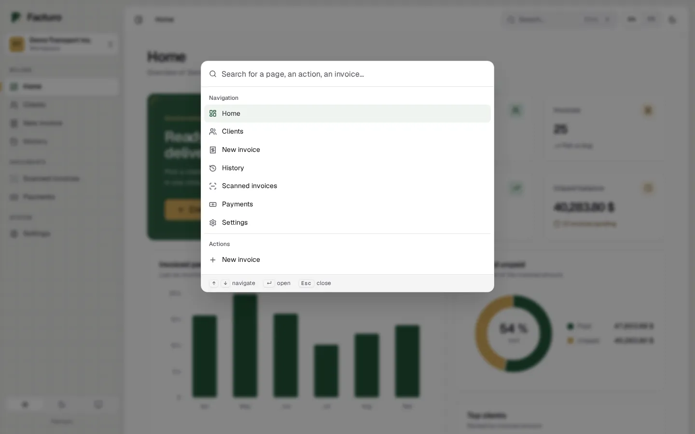
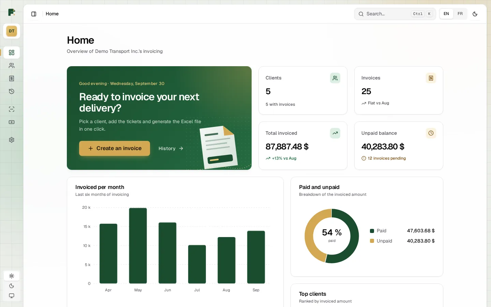
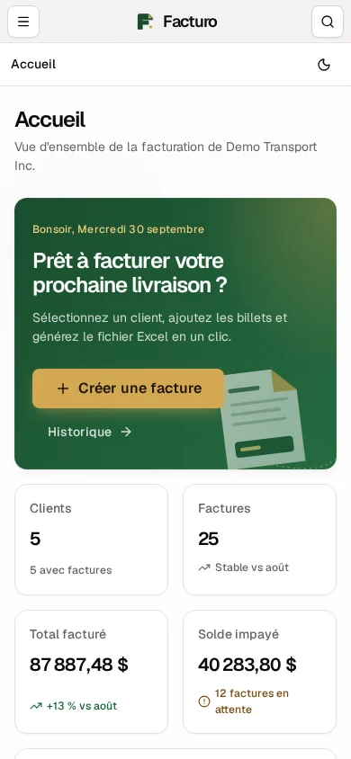

# Facturo

[](LICENSE)




Facturo is a local-first invoicing app for a small Québec trucking company.
Drivers hand in paper work tickets ("billets": hours worked by a truck at a
renter's worksite). Facturo turns them into tax-correct invoices, reads the
handwritten ones with a local vision model, and reconciles supplier payment
statements against what was billed.

It runs as a single Windows program (`Factures.exe`) that serves a browser UI on
`127.0.0.1`. It has no cloud backend and no accounts. Data syncs between devices
through a private Git repository, and the app updates itself from GitHub
Releases, rolling back automatically if an update fails.

> **All data in this repository is fictional.** The company (`Demo Transport
> Inc.`), renters, worksites, plates, addresses and amounts in the code, tests
> and docs were all invented for this public version. The project started as
> a real client app. This is a one-time snapshot with every client identity
> removed.

## Features

- **Invoices from billets:** hours × hourly rate per billet, exported to Excel
  (`.xlsx`) from a template and to PDF through LibreOffice. Invoices can be
  split by worksite (chantier).
- **Dual discounts:** a percentage and/or a fixed amount, on each billet and
  on the whole invoice, applied before TPS (5%) and TVQ (9.975%). Python and
  JavaScript share one set of test fixtures, and there's a migration from the
  v1 model that is checked against a frozen oracle. See
  [docs/DISCOUNTS.md](docs/DISCOUNTS.md).
- **Invoice history and filters:** filter by client, payment status and date,
  search free text without caring about accents, and sort. Totals and payment
  status are computed on the server.
- **Payment matching:** import proof-of-payment PDFs and parse their headers,
  totals and billet rows. Each row is matched to a billed ticket, first by
  number, then by date + plate + quantity. Duplicates get flagged, and an
  invoice is marked paid automatically once all its billets are covered. A
  supplier bill addressed to the company is refused. See
  [docs/PAYMENTS.md](docs/PAYMENTS.md).
- **AI billet extraction:** photos, HEIC and scanned PDFs are read by a
  vision model served by [Ollama](https://ollama.com), locally or in the
  cloud, which returns structured JSON. Plain-Python post-processing then
  fixes dates, plates and hour notations, and snaps misread names and plates
  to a curated list of known values using edit distance.
- **Known-values curation:** worksite and plate autocomplete comes from a
  table the user can rename, hide and merge, so one bad invoice can't
  permanently mislead the AI.
- **Multi-device sync:** Receive/Send against a private GitHub data repo,
  using pure-Python git (dulwich). Before a reset the app takes a backup, the
  repo URL is checked against an allow-list, and a schema guard blocks syncing
  with an older app version. See [docs/SYNC.md](docs/SYNC.md).
- **Auto-update pipeline:** `scripts/release.sh` handles semver checks, tests,
  lint, a migration dry run, the CHANGELOG roll and the tag. A GitHub Actions
  workflow builds the exe, smoke-tests it and publishes it with a SHA-256 file.
  In the app, the update is checked against that hash, the new exe is swapped
  in, and a health check triggers a rollback on failure. See
  [docs/UPDATES_AND_RELEASES.md](docs/UPDATES_AND_RELEASES.md).
- **Modern interface:** a shadcn/ui-style design system with light, dark and
  system themes, a Ctrl+K command palette (fuzzy, accent-insensitive search
  over pages, actions, clients and invoices), a collapsible sidebar, SVG
  charts on the home page, row menus and right-click context menus, sonner-style
  toasts, and accessible dialogs, sheets, tabs and tooltips (focus trap, roving
  tabindex, reduced-motion support). Fonts (Geist) and icons (Lucide) are
  bundled, so the whole UI works offline. See [docs/UI.md](docs/UI.md).
- **Tests and CI:** about 700 pytest tests (unit, API, Playwright e2e) plus
  node parity tests, run with ruff on every push. See
  [docs/TESTING.md](docs/TESTING.md).

## Tech stack

| Layer | Choice |
|-------|--------|
| Backend | Python 3.11+, FastAPI, Uvicorn, SQLite (hand-written migrations, `PRAGMA user_version`) |
| Frontend | Vanilla JavaScript and CSS, plain `<script>` tags, no build step |
| Documents | openpyxl (Excel), LibreOffice headless (PDF), pypdfium2 (PDF text and rasterising), Pillow + pillow-heif |
| AI | Ollama vision models with structured JSON output |
| Sync / updates | dulwich (pure-Python git), GitHub Releases API, Windows DPAPI for tokens at rest |
| Packaging | PyInstaller (`Factures.exe`), portable LibreOffice |
| Quality | pytest, pytest-cov, Playwright, node:test, ruff, GitHub Actions |

## Screenshots

All captures use the fictional data from `scripts/seed_demo.py`.

| | |
|---|---|
|  **Home:** KPIs, charts |  **Dark theme** |
|  **History:** filters, status, row actions |  **New invoice:** live totals |
|  **Payments:** proof-of-payment detail |  **Clients** |
|  **Settings** |  **Command palette** (Ctrl+K) |
|  **Collapsed sidebar** |  **Mobile** (390 px) |

## Quick start (development)

```bash
git clone https://github.com/Yahya-github/facturo-demo.git
cd facturo-demo
python -m venv venv
. venv/bin/activate                  # Windows: venv\Scripts\activate
pip install -r requirements-dev.txt
playwright install chromium          # browser for the e2e suite

python -m facturo                    # start the app and open the browser
python -m pytest                     # full test suite (unit + e2e)
ruff check .                         # lint
python -m facturo --smoke-test       # boot once on a throwaway data dir, print version
```

`python -m facturo` listens on `127.0.0.1:8000`, falling back to 8001–8003 and
then a random free port. Flags: `--port N` (strict, no fallback),
`--no-browser`, `--smoke-test`. Dev data goes in `data/` (gitignored). Set
`FACTURO_DATA_DIR` to use another folder and `FACTURO_COMPANY_NAME` to invoice
under a different company name.

To look around with realistic content, start the app on a throwaway data
folder and fill it with fictional clients, 25 invoices and three payments:

```bash
FACTURO_DATA_DIR=/tmp/facturo-demo python -m facturo --port 8000 --no-browser &
python scripts/seed_demo.py --base http://127.0.0.1:8000    # safe to run twice
```

AI extraction is optional and needs an Ollama server, local or cloud,
configured in the app's settings. Everything else works without it.

## Repository layout

```
facturo/
  __main__.py      CLI entry (python -m facturo), port choice, --smoke-test
  server.py        FastAPI app: LocalGuardMiddleware, /static, routers
  brand.py         Company name and tax numbers (Demo Transport Inc. by default)
  api/             HTTP routers: invoices, invoice list, clients, scans, AI,
                   known values, payments, settings, sync, updates
  core/            SQLite access, schema + migrations, billet normalisation,
                   known values
  invoicing/       discounts.py (all totals), excel_generator.py (xlsx + PDF)
  extraction/      Ollama client and prompts, scan rendering
  payments/        PDF text, parser, matcher, store
  services/        sync.py (GitHub data sync), updater.py (in-app updates)
  web/             templates/index.html + static/ (css, js, js/ui, fonts, img)
packaging/         PyInstaller spec, build and package scripts, release notes
scripts/           release.sh, start/stop helpers
.github/workflows/ ci.yml (every push/PR), release.yml (v* tags)
tests/             pytest suite, tests/e2e (Playwright), tests/js (node parity)
docs/              Architecture and operations docs (index: docs/README.md)
```

## Design notes

- **Security:** the server listens only on 127.0.0.1. `LocalGuardMiddleware`
  refuses a non-loopback `Host` and state-changing requests from another
  origin, which blocks DNS rebinding and CSRF from other pages open in the
  browser.
- **Fail visible, not wrong:** a date, plate or billet number that can't be
  read with confidence is left blank for the user rather than guessed. A blank
  field gets noticed. A wrong invoice line doesn't.
- **Pure core:** billet normalisation and discount math do no I/O at all, so
  they can be tested without a GPU, a network or a database.

## Documentation

[docs/README.md](docs/README.md) lists the architecture, discounts, payments,
sync, updates, Windows install, testing and French user guide docs.

## Project history

Facturo was built privately for a real transport company, from June 2026 onward. This repository is a **sanitized public snapshot**: every client name, address, plate, tax number and document has been replaced with fictional data, and the company name is a setting (`Demo Transport Inc.` by default).

The commit history here is a **condensed replay**, not the original log. Each commit adds the files that first appeared in the private project at that moment, and the commit dates and times are the real ones. Files carry their final sanitized content, so an intermediate commit may not run on its own. The original private history is not published because it contains client data.

## Credits

- Design language: [shadcn/ui](https://ui.shadcn.com) (MIT). Only the visual
  language is followed (tokens, radii, component anatomy); the components here
  are hand-written vanilla JavaScript.
- Icons: [Lucide](https://lucide.dev) (ISC), inlined as SVG.
- Font: [Geist](https://vercel.com/font) and Geist Mono by Vercel
  (SIL Open Font License 1.1, see `facturo/web/static/fonts/OFL.txt`), bundled
  as woff2.
- Layout patterns (bento dashboard, command palette, sonner-style toasts) are
  inspired by the [21st.dev](https://21st.dev) community. No code was copied.

## License

[MIT](LICENSE) © Yahya-github
